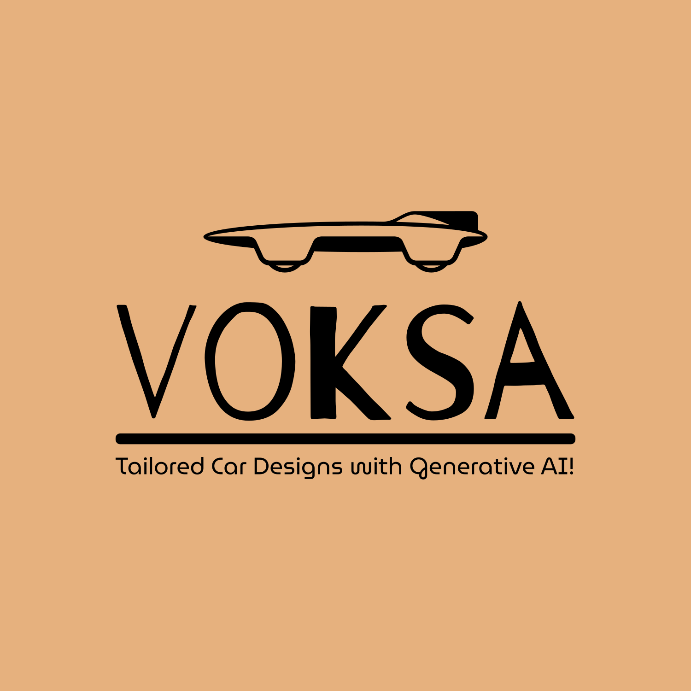
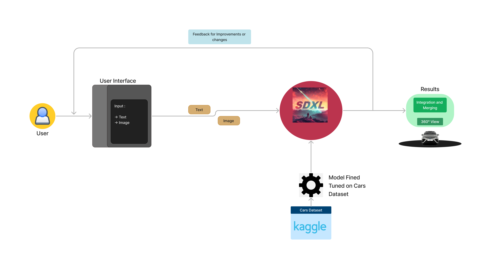

<p align="center">
   </p>
  <br>

     
</p>


___
## About

In the current automotive industry, personalization is highly significant as consumers want vehicles that reflect their individuality. Traditional design methods, while effective, have limitations in capturing the nuances of each customer's vision, potentially resulting in a gap between expectations and reality.

`Voksa` harnesses Generative AI to craft personalized car designs, tailored to individual preferences. This approach revolutionizes traditional design methods, ensuring each design is not only aesthetically pleasing but also functional and aligned with Volkswagen's brand standards.


___
## Quickstart

<p>
  <h4>Local Environment</h4> <br>
  
  Clone the repository:
  ```
  git clone https://github.com/Vishesht27/Voksa4.git 
  ```
  Download the necessary librarires
  ```
  !pip install -r requirements.txt
  ```
  Run the command in terminal
  ```
  streamlit run app.py
  ```
  <br>

  <h4>Streamlit App</h4> <br>
  <p> Open the link: <a href="https://voksagen.streamlit.app"> voksagen.streamlit.app </a> </p>

</p>


___
## Architecture
<p align="center">
  
</p>
<p>
 <b> How does the application work: </b> 
  <br>
  <li> The user is asked to provide the imagination for the personalised looks and feature in any Volkswagen car using the provide user interface. </li>
  <li> The text is then prompted to StableDiffusionPipeline which is fine-tuned for specific modification in car using vast amount of training dataset: <a href="https://deepvisualmarketing.github.io/"> Link</a>. </li>
  <li> If the results are not satisfied, the image is taken as refernce and new image is generate till the customer satisfies. </li>
  <li> The finished image is sent to further design team to make nesecarry modifications for customers car. </li>
</p>

___
## Contributors
| <a href="https://github.com/Vishesht27"></a>| <a href="https://github.com/HemanthSai7"></a>| <a href="https://github.com/Vice777"></a>| <a href="https://github.com/Alok-Khansali"></a>|
| :---: | :---: | :---: | :---: |
| **[Vishesh Tripathi](https://github.com/Vishesht27)**| **[Hemanth Sai Garladinne](https://github.com/HemanthSai7)**| **[Vivek Dharewa](https://github.com/Vice777)**| **[Alok Khansali](https://github.com/Alok-Khansali)**|
| <a href="https://www.linkedin.com/in/vishesh-tripathi-3a62961b8/"></a> | <a href="https://linkedin.com/in/hemanthsai7"></a>| <a href="https://www.linkedin.com/in/vivek-dharewa/"></a>| <a href="https://in.linkedin.com/in/alok-khansali"></a>|

___
## About Us

This app was developed by [Vishesh Tripathi](https://github.com/Vishesht27), [Hemanth Sai](https://github.com/HemanthSai7), [Vivek Dharewa](https://github.com/Vice77) and [Alok Khansali](https://github.com/Alok-Khansali), to our innovative solution harnesses Generative AI to craft personalized car designs, tailored to individual preferences. This approach revolutionizes traditional design methods, ensuring each design is not only aesthetically pleasing but also functional and aligned with Volkswagen's brand standards.
  
___
## Show your support

Give a ⭐️ if this project helped you!
